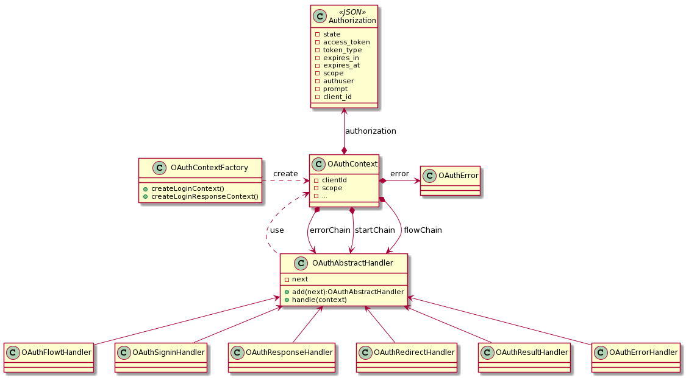
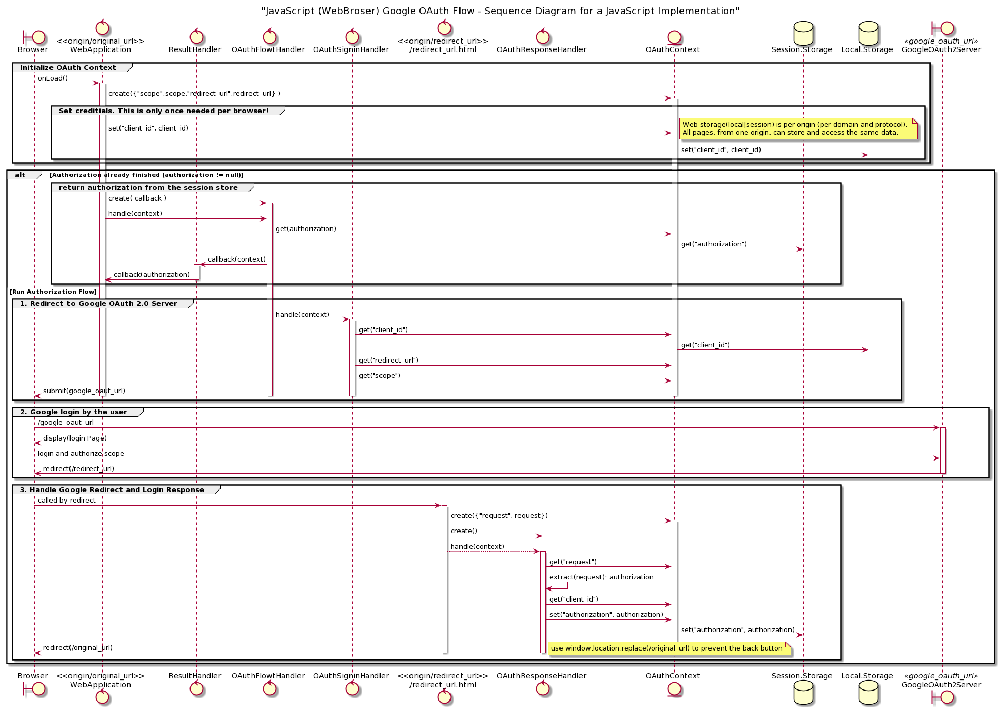

# The design

## Basic design concepts

One core design pattern is used:

- [The chain of responsibility](https://refactoring.guru/design-patterns/chain-of-responsibility)

Chains of handlers are created to build a defined flow:
- The handlers do not now each others
- Each hanlder does a specific task an the hands on to the next
- There are three chains:
  - A error chain, for handling errors
  - A start chain, to beginn with
  - A flow chain, which does the 3 step OAuth 2.0 flow
- Handlers are operating on a context
- The context contains all chains, the initial data and will be enriched by every handler

## Diagrams

The following diagrams are conceptual diagrams. Small deviations (more classes or method parameters) to the implementation are possible!

### Class diagram

### Sequence Diagram

